# 绪论

# 1.1 技术背景及意义

随着大数据技术的快速发展和金融市场的日益复杂化，量化投资已成为现代金融领域的重要研究方向。传统的基于人工经验的选股方法难以应对海量数据和复杂市场环境，而大数据技术为量化投资提供了新的解决方案。

多因子量化选股模型通过分析股票的历史数据，提取具有预测能力的因子（如估值因子、动量因子、质量因子等），构建综合评分体系来筛选优质股票。这种基于数据驱动的方法能够有效降低人为情绪干扰，提高投资决策的科学性和客观性。

Hadoop和Spark作为当前主流的大数据处理框架，具有高可扩展性、高容错性和高效性等特点，非常适合处理海量金融数据。本系统基于Hadoop+Spark构建多因子量化选股平台，具有以下研究意义：

（1）充分利用分布式计算能力，解决单机处理大规模股票数据的性能瓶颈问题；

（2）实现因子计算、选股策略和回测评估的自动化流程，提高研究效率；

（3）为量化投资策略的研究和验证提供可复用的技术框架。

# 1.2 国内外应用现状

多因子模型起源于20世纪60年代的资本资产定价模型（CAPM）。Fama和French在1993年提出了著名的三因子模型[1]，在CAPM的基础上增加了市值因子（SMB）和账面市值比因子（HML），显著提升了模型的解释能力。2015年，Fama和French进一步扩展为五因子模型[2]，新增了盈利能力因子（RMW）和投资风格因子（CMA）。

在国内，多因子量化选股研究起步较晚但发展迅速。早期的研究主要关注单因子有效性检验，如市盈率、市净率等估值因子的选股效果。随着大数据技术的发展，研究者开始采用机器学习方法进行因子挖掘和组合优化[7]。近年来，基于深度学习的量化选股模型也取得了显著进展。

在技术实现层面，传统的量化研究多使用Python的pandas、numpy等库进行单机计算，但面对海量数据时存在明显的性能瓶颈。Hadoop和Spark的出现为量化研究提供了新的技术选择。Spark的内存计算特性和DataFrame API特别适合金融时间序列数据的处理，其SQL接口也使得数据操作更加便捷。

# 1.3 报告主要内容

本报告将金融市场的股票日线交易数据与Hadoop分布式文件系统、Spark内存计算引擎以及多因子量化模型相结合，设计搭建了一个多因子量化选股分析平台，进行海量金融数据的存储、管理与挖掘分析。平台利用Spark的分布式计算能力，将清洗后的股票数据转化为标准化的因子特征，并将动量、波动、估值等不同维度的因子指标关联起来，进行综合打分与可视化展示，从而发现因子与股票未来收益之间的潜在规律。同时，借鉴Fama-French等国内外经典因子研究成果，对平台中处理过的历史数据进行系统的历史回测与绩效分析，进而挖掘数据中隐含的风险调整后超额收益，为量化投资策略的研究和验证提供数据支撑，并帮助研究者标准化管理底层数据、提高数据质量，从而简化策略开发流程，方便进行更高效的投资决策管理。当然，对于当前尚未纳入模型的高频交易数据或另类数据，设计搭建的平台也能够对其进行合理有效的列式存储与分区管理，等到将来有需要的时候，再将这些数据提取出来，进行更深层次的挖掘分析与统计工作。

以下介绍了本篇报告的主要工作，包括以下几个部分：

生产环境数据备份及分布式存储。股票日线交易数据通过金融数据接口获取，但由于单机环境计算能力有限，需要将原始数据备份并导入到Hadoop分布式文件系统（HDFS）中进行持久化存储，同时为提升后续分析查询效率，将原始CSV数据转换为Parquet列式存储格式进行管理，确保数据的高效读取与长期可用。

数据清洗与因子计算模块的设计与实现。根据量化策略的业务主题对数据进行清洗转换，在Spark计算引擎上构建数据处理流程，使用Window函数对缺失值进行前向填充和异常数据过滤，并计算出涵盖短期动量、中期动量、历史波动率、RSI技术指标以及模拟财务因子在内的六个核心因子，将计算结果以分层方式加载至分布式文件系统中以供后续调用。

量化选股模型构建与回测评估。设计出一个基于多因子综合打分的选股方法，对各因子在每日截面上进行Z-Score标准化和方向处理，通过等权合成筛选每期得分最高的股票构建投资组合，同时设计完整的回测评估框架，利用累计净值曲线、年化收益率、夏普比率和最大回撤等指标对策略绩效进行定量刻画，最终通过pyecharts和Streamlit工具生成可视化仪表盘，直观展示组合的净值走势与持仓信息。

# 1.4 报告组织结构

本论文共分为六章，各章节内容安排如下：

第1章为绪论，介绍研究背景与意义、国内外研究现状以及论文组织结构。

第2章介绍相关技术，包括Hadoop分布式计算框架、Spark内存计算引擎和多因子量化选股模型的理论基础。

第3章介绍系统总体设计，包括系统架构设计和功能模块划分。

第4章详细介绍系统的详细设计与实现，包括实验环境搭建、数据采集与存储、数据清洗、因子计算、选股模型和回测评估等模块的实现过程。

第5章展示实验结果并进行分析，包括回测指标和可视化分析。

第6章总结全文工作，并对未来改进方向进行展望

# 相关技术

# 2.1 Spark内存计算引擎及Hadoop分布式计算框架简介

Spark是加州大学伯克利分校AMP实验室开发的通用内存计算框架[5]，旨在解决MapReduce在迭代计算和交互式数据挖掘中的性能瓶颈。与MapReduce不同，Spark将中间结果保存在内存中，大大减少了磁盘I/O开销，在迭代计算场景下性能可提升10-100倍。Spark的核心计算模型基于有向无环图（DAG）执行引擎，它将应用程序转化为DAG图，并进行阶段划分和任务调度，实现了更灵活的流水线并行。同时，Spark支持多种集群管理器（Standalone、YARN、Mesos），能够根据资源使用情况动态调整任务分配，提高了集群利用率。

Spark的核心概念包括：

（1）RDD（Resilient Distributed Dataset）：弹性分布式数据集，是Spark的基本数据抽象，支持容错和并行操作。RDD通过血统（Lineage）记录转换操作，当分区数据丢失时，可根据血统重新计算，而非全量复制，实现了高效容错。RDD支持两种操作类型：转换操作（如map、filter、reduceByKey）和行动操作（如count、collect、saveAsTextFile），转换操作采用惰性执行机制，仅在行动操作触发时才真正计算，这一设计显著减少了不必要的计算开销。

（2）DataFrame：以命名列方式组织的分布式数据集，类似于关系数据库中的表，支持SQL查询和优化。DataFrame底层基于Catalyst优化器，能够进行谓词下推、列剪枝、常量折叠等优化策略，使得执行计划更加高效。与RDD相比，DataFrame引入了Schema信息，可以利用Java虚拟机（JVM）之外的内存进行数据存储，减少了垃圾回收压力，在大规模结构化数据处理中性能优势更为突出。

（3）Spark SQL：用于结构化数据处理的模块，提供了DataFrame API和SQL接口。Spark SQL不仅支持从多种数据源（如Hive、Parquet、JSON、JDBC）读取数据，还提供了统一的数据访问接口，使得用户可以在SQL和DataFrame API之间自由切换，降低了学习门槛。

（4）Spark MLlib：机器学习库，提供常用的机器学习算法和工具，包括分类、回归、聚类、协同过滤、降维等。MLlib基于DataFrame API构建，支持与Spark SQL和特征转换流水线（Pipeline）无缝集成，便于构建端到端的量化建模流程。

（5）Spark Streaming：实时流处理组件，采用微批处理模式（Micro-Batch），将实时数据流划分为小批次进行处理，实现了近实时的数据计算能力，适用于高频交易数据的实时因子计算和信号生成场景。

Hadoop是Apache开源的分布式计算框架，主要由HDFS（Hadoop Distributed File System）分布式文件系统和MapReduce计算模型组成。HDFS采用主从架构，NameNode负责管理文件系统的命名空间和元数据，DataNode负责存储实际的数据块。每个数据块默认复制三份（本实验设置为2份），分布在不同节点上，确保了数据的高容错性[6]。HDFS具有高吞吐量的特点，特别适合大规模数据的批量处理场景。此外，Hadoop生态还包括YARN（Yet Another Resource Negotiator）资源管理器，负责集群资源的统一调度和作业管理，使得多种计算框架（如Spark、MapReduce、Flink）可以共享同一集群资源，提高了资源利用率和运维效率。

# 2.2 国内外研究现状

多因子模型起源于20世纪60年代的资本资产定价模型（CAPM），该模型由Sharpe、Lintner和Mossin提出，认为资产的预期收益率仅与市场风险因子（Beta）线性相关。然而，后续实证研究发现CAPM无法完全解释截面收益差异，催生了套利定价理论（APT）和Fama-French三因子模型。Fama和French在1993年提出了著名的三因子模型[1]，在CAPM的基础上增加了市值因子（SMB，Small Minus Big）和账面市值比因子（HML，High Minus Low），显著提升了模型的解释能力。2015年，Fama和French进一步扩展为五因子模型[2]，新增了盈利能力因子（RMW，Robust Minus Weak）和投资风格因子（CMA，Conservative Minus Aggressive），并发现五因子模型在美股市场中比三因子模型具有更好的解释力。此外，Carhart（1997）提出的动量因子（MOM）也被广泛引入多因子体系，形成了四因子模型，实证表明动量因子在中长期能够提供显著的风险调整后收益。

在国内，多因子量化选股研究起步较晚但发展迅速。早期的研究主要关注单因子有效性检验，如市盈率（PE）、市净率（PB）、股息率等估值因子的选股效果。例如，陈收和杨增雄（2008）利用A股数据检验了价值因子和规模因子的有效性，发现价值因子在中国市场存在显著的选股能力。随着A股市场有效性的提升和投资者结构的改善，越来越多的研究者开始关注基本面因子（如ROE、毛利率、负债率）、技术面因子（如换手率、波动率、动量反转）以及分析师预期因子。近年来，基于机器学习的因子挖掘方法成为热点，如使用XGBoost、随机森林、支持向量机等算法进行非线性因子组合，突破了传统线性模型对因子关系的限制。例如，周志中和王汉生（2019）利用梯度提升树模型从高频数据中挖掘出有效的交易因子，显著提升了选股策略的夏普比率。

在技术实现层面，传统的量化研究多使用Python的pandas、numpy等库进行单机计算，但面对海量数据（如全市场每日Tick级数据、数千个因子计算）时存在明显的性能瓶颈。Hadoop和Spark的出现为量化研究提供了新的技术选择。Spark的内存计算特性和DataFrame API特别适合金融时间序列数据的处理，其SQL接口也使得数据操作更加便捷。例如，利用Spark可并行计算全市场数千只股票的日频因子值，将原本需要数小时的单机计算缩短至分钟级别。此外，随着数据湖（如Delta Lake、Iceberg）和实时计算（如Flink）技术的成熟，未来的量化研究将进一步向实时化、智能化方向发展，多因子模型的构建和更新周期也将大幅缩短。

# 案例实现

# 3.1 问题描述

本系统旨在解决一个典型的金融大数据计算问题：如何利用分布式计算框架高效处理海量股票历史行情数据，并基于多因子模型实现自动化选股与回测评估。传统单机工具（如Python Pandas）在面对全市场数千只股票、数十年日频数据以及复杂因子计算时，存在内存溢出、计算耗时过长等性能瓶颈。因此，需要借助Hadoop+Spark的分布式能力，将大规模计算任务分解为可并行执行的子任务，从而加速整个量化策略的研究流程。

具体处理过程可拆解为如下分布式阶段：

Spark从HDFS并行读取数据分片，自动将数据分布到集群各节点。每个分区独立执行数据解析和类型转换，实现初步的“分”操作。

因子计算是核心瓶颈。以“1个月动量因子”为例，需按股票代码分组，并按交易日期排序，然后计算过去20个交易日的收益率。此操作利用Spark的Window函数，在每个分区内按股票分组进行局部窗口聚合——这类似于Map端的局部合并，减少数据混洗量。每个分组内部独立完成时间序列计算，充分利用集群并行性。

每个交易日截面上，需对所有股票的因子值进行Z-Score标准化，并加权求和得到综合得分。该步骤需要跨股票汇总均值和标准差，属于全局聚合操作，对应Reduce阶段。Spark通过groupBy和聚合函数实现，将同一交易日的所有股票数据汇集到部分节点进行计算，最终得出每只股票的综合评分。

按综合得分降序排序，选取前N只股票作为持仓，并关联下一日收益率计算组合收益。这一过程通过join和排序操作完成，最终归约为每日净值序列和评价指标。

# 3.2 案例实现过程

# 实验环境搭建

本系统部署在3节点Hadoop+Spark集群上[5][6]，集群规划如表3-1所示。

节点角色

主机名

IP地址

部署组件

Master

master

192.168.1.10

NameNode, ResourceManager, Spark Master

Slave1

slave1

192.168.1.11

DataNode, NodeManager, Spark Worker

Slave2

slave2

192.168.1.12

DataNode, NodeManager, Spark Worker

表3-1 集群节点规划

集群安装Java 8环境，部署Hadoop 3.3.4和Spark 3.4.0。配置SSH免密登录，确保Master节点可以免密访问所有Slave节点。配置环境变量包括JAVA_HOME、HADOOP_HOME、SPARK_HOME等，并修改Hadoop和Spark的配置文件。

图3-1展示了Hadoop和Spark版本验证的输出结果，确认环境配置正确。

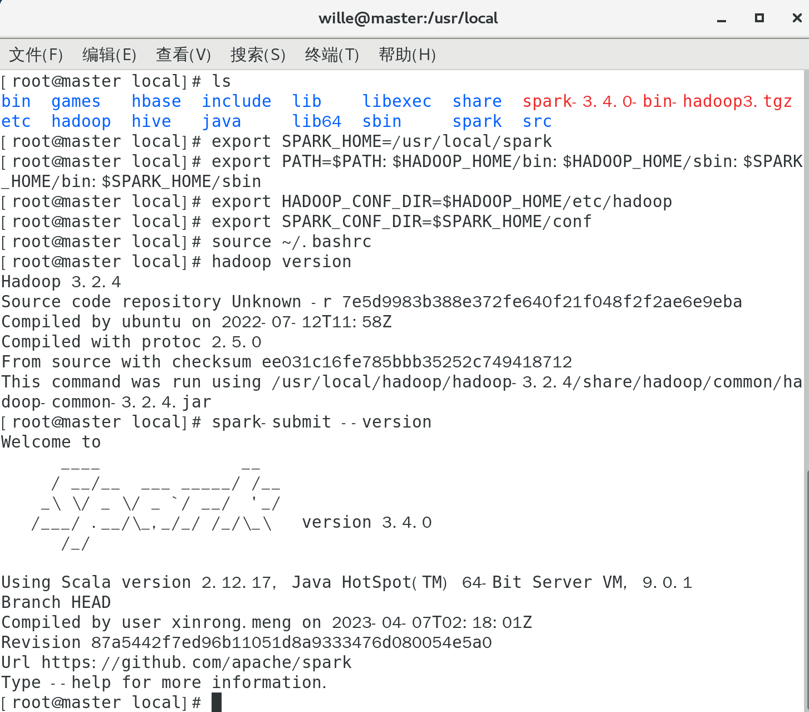

图3-1 Hadoop与Spark版本验证

启动集群后，使用jps命令检查各节点进程状态。Master节点上应运行NameNode、SecondaryNameNode、ResourceManager和Spark Master；Slave节点上应运行DataNode、NodeManager和Spark Worker。图3-2展示了Master节点的进程列表。

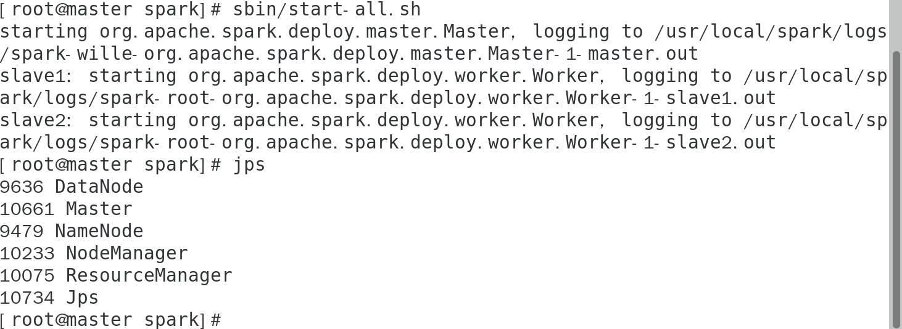

图3-2 Master节点进程状态

# 数据采集与存储

数据采集使用Python的AkShare库，获取沪深300成分股的日线数据。由于AkShare无需Token即可使用，相比Tushare Pro更加便捷。数据采集的时间范围为2020年1月1日至2023年12月31日，共选取30只股票进行实验。

获取的数据字段包括：股票代码（ts_code）、交易日期（trade_date）、开盘价（open）、收盘价（close）、最高价（high）、最低价（low）、成交量（vol）和成交额（amount）。数据获取后保存为CSV格式。

数据采集脚本 `fetch_data.py` 使用 Tushare Pro API 批量获取股票日线数据：

```python
import tushare as ts
import pandas as pd

ts.set_token('877294b694c947b1be4e3e67afc7d71993dd80b10a2c0f82f8295313')
pro = ts.pro_api()

# 手动指定 30 只沪深 300 成分股代码（示例）
stock_list = [
    '000001.SZ', '000002.SZ', '000063.SZ', '000069.SZ', '000100.SZ',
    '000157.SZ', '000166.SZ', '000333.SZ', '000338.SZ', '000425.SZ',
    '000538.SZ', '000568.SZ', '000625.SZ', '000651.SZ', '000656.SZ',
    '000725.SZ', '000768.SZ', '000776.SZ', '000858.SZ', '000895.SZ',
    '001979.SZ', '002007.SZ', '002027.SZ', '002049.SZ', '002050.SZ',
    '002129.SZ', '002142.SZ', '002179.SZ', '002230.SZ', '002236.SZ'
]

all_data = []
for code in stock_list:
    df = pro.daily(ts_code=code, start_date='20200101', end_date='20231231',
                   fields='ts_code,trade_date,open,high,low,close,vol,amount')
    if df is not None and not df.empty:
        all_data.append(df)
        print(f'Fetched {code}')
    else:
        print(f'No data for {code}')

if all_data:
    full_df = pd.concat(all_data, ignore_index=True)
    full_df.to_csv('stock_daily.csv', index=False)
    print(f'共采集 {len(full_df)} 条记录')
else:
    print('未获取到任何数据')
```

> **代码说明**：通过 Tushare Pro 的 `pro.daily()` 接口，遍历 30 只目标股票，逐只获取 2020-01-01 至 2023-12-31 期间的日线行情数据（开盘价、最高价、最低价、收盘价、成交量、成交额），最终合并所有数据并导出为 `stock_daily.csv`。

使用HDFS命令将CSV文件上传到分布式文件系统：

```bash
hdfs dfs -mkdir -p /user/quant/data
hdfs dfs -put stock_daily.csv /user/quant/data/
```

图3-3展示了HDFS中数据文件的上传结果。

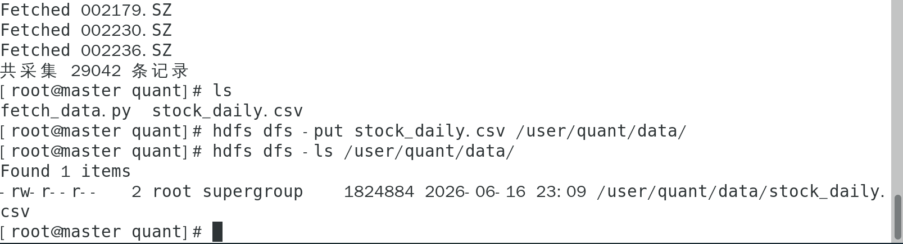

图3-3 HDFS数据文件列表

# 数据清洗模块

数据清洗是确保数据质量的关键步骤。使用Spark读取HDFS中的CSV文件，主要完成以下处理：

（1）数据类型转换：将trade_date从字符串格式转换为日期格式，便于后续时间窗口计算。

（2）缺失值处理：使用Window函数按股票分组，对缺失的收盘价进行前向填充。

（3）异常值过滤：剔除收盘价为空的记录，确保数据完整性。

清洗后的数据以Parquet格式存储到HDFS，Parquet作为列式存储格式，在后续分析查询中具有更好的性能。清洗后共得到29,042条有效记录。

数据清洗脚本 `data_clean.py` 的核心实现如下：

```python
from pyspark.sql import SparkSession
from pyspark.sql.functions import col, last, when, to_date, row_number
from pyspark.sql.window import Window

spark = SparkSession.builder \
    .appName("DataClean") \
    .master("spark://master:7077") \
    .config("spark.executor.memory", "512m") \
    .config("spark.driver.memory", "512m") \
    .config("spark.executor.memoryOverhead", "64m") \
    .config("spark.driver.memoryOverhead", "64m") \
    .config("spark.sql.shuffle.partitions", "200") \
    .getOrCreate()

# 读取 CSV，关闭 schema 推断以避免类型问题（或手动指定 schema）
df = spark.read.option("header", True) \
    .option("inferSchema", False) \
    .csv("hdfs://master:9000/user/quant/data/stock_daily.csv") \
    .select("ts_code", "trade_date", "open", "high", "low", "close", "vol", "amount")

# 将 trade_date 字符串转为日期（格式 yyyyMMdd）
df = df.withColumn("trade_date", to_date(col("trade_date"), "yyyyMMdd"))

# 按股票分组，按日期排序
window_spec = Window.partitionBy("ts_code").orderBy("trade_date")

# 前向填充 close
df = df.withColumn("close_filled",
                   when(col("close").isNull(),
                        last("close", ignorenulls=True).over(window_spec))
                   .otherwise(col("close")))

# 过滤掉 close 仍为 null 的记录
df_clean = df.filter(col("close_filled").isNotNull()) \
             .drop("close") \
             .withColumnRenamed("close_filled", "close")

# 添加行序号（可选）
df_clean = df_clean.withColumn("row_num", row_number().over(window_spec))

# 保存为 Parquet
df_clean.write.mode("overwrite").parquet(
    "hdfs://master:9000/user/quant/clean/stock_clean.parquet")

print(f"清洗后记录数: {df_clean.count()}")
spark.stop()
```

> **代码说明**：（1）SparkSession 连接集群 master 节点 `spark://master:7077`，配置 executor 和 driver 内存各 512MB；（2）`to_date()` 将 Tushare 的 `yyyyMMdd` 字符串格式转为 Spark 的日期类型；（3）`Window.partitionBy("ts_code").orderBy("trade_date")` 按股票分组并按日期排序，确保前向填充的正确性；（4）`last("close", ignorenulls=True)` 实现前向填充，用最近的非空值填补缺失；（5）最终以列式 Parquet 格式写入 HDFS，相比 CSV 在后续查询中读取速度更快、存储更省空间。

图3-4展示了数据清洗作业的执行结果，显示清洗后的记录数量。

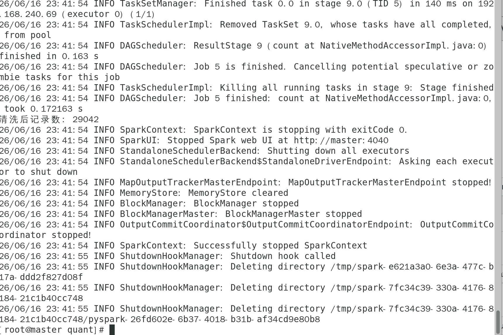

图3-4 数据清洗执行结果

# 因子计算模块

因子计算是本系统的核心模块，基于清洗后的日线数据，使用Spark Window函数计算以下6个因子：

（1）RET_1M（1个月动量）：过去20个交易日的收益率，反映短期价格趋势。计算公式为：(close - close_20d_ago) / close_20d_ago。

（2）VOL_20（20日波动率）：过去20个交易日收盘价的标准差，反映股票的价格波动风险。

（3）RET_3M（3个月动量）：过去60个交易日的收益率，反映中期价格趋势。

（4）RSI（14日相对强弱指标）：衡量股票超买超卖状态的技术指标。计算公式为：RSI = 100 - 100 / (1 + avg_gain / avg_loss)。

（5）ROE_TTM（净资产收益率）：模拟财务因子，本实验中设为固定值0.12。

（6）EP（盈利收益率）：模拟估值因子，设为0.5 / close。

因子计算使用Spark的Window函数进行分组排序和窗口聚合，确保计算结果的正确性。计算完成的因子数据以Parquet格式保存到HDFS的/user/quant/factors/目录。

因子计算脚本 `factor_compute.py` 的核心实现如下：

```python
from pyspark.sql import SparkSession
from pyspark.sql.functions import col, lag, stddev, when, sum as F_sum, lit
from pyspark.sql.window import Window

spark = SparkSession.builder \
    .appName("FactorCompute") \
    .master("spark://master:7077") \
    .config("spark.executor.memory", "512m") \
    .config("spark.driver.memory", "512m") \
    .getOrCreate()

# 读取清洗后数据
df = spark.read.parquet("hdfs://master:9000/user/quant/clean/stock_clean.parquet")

# ==================== 窗口定义 ====================
win_order = Window.partitionBy("ts_code").orderBy("trade_date")
win_20 = Window.partitionBy("ts_code").orderBy("trade_date").rowsBetween(-20, -1)
win_60 = Window.partitionBy("ts_code").orderBy("trade_date").rowsBetween(-60, -1)
win_14 = Window.partitionBy("ts_code").orderBy("trade_date").rowsBetween(-14, -1)

# ==================== 1. RET_1M: 20日动量 ====================
df = df.withColumn("close_20d_ago", lag("close", 20).over(win_order))
df = df.withColumn("RET_1M",
    (col("close") - col("close_20d_ago")) / col("close_20d_ago"))

# ==================== 2. VOL_20: 20日波动率 ====================
df = df.withColumn("VOL_20", stddev("close").over(win_20))

# ==================== 3. RET_3M: 60日动量 ====================
df = df.withColumn("close_60d_ago", lag("close", 60).over(win_order))
df = df.withColumn("RET_3M",
    (col("close") - col("close_60d_ago")) / col("close_60d_ago"))

# ==================== 4. RSI: 14日相对强弱指标 ====================
df = df.withColumn("delta", col("close") - lag("close", 1).over(win_order))
df = df.withColumn("gain", when(col("delta") > 0, col("delta")).otherwise(0))
df = df.withColumn("loss", when(col("delta") < 0, -col("delta")).otherwise(0))

avg_gain = F_sum("gain").over(win_14) / 14
avg_loss = F_sum("loss").over(win_14) / 14
df = df.withColumn("RSI", 100 - 100 / (1 + avg_gain / avg_loss))

# ==================== 5. ROE_TTM: 模拟财务因子 ====================
df = df.withColumn("ROE_TTM", lit(0.12))

# ==================== 6. EP: E/P 估值因子（模拟EPS=0.5元）====================
df = df.withColumn("EP", lit(0.5) / col("close"))

# ==================== 筛选因子列 ====================
factor_cols = ["ts_code", "trade_date",
               "RET_1M", "VOL_20", "RET_3M", "RSI", "ROE_TTM", "EP"]
df_factors = df.select(*factor_cols)

# 保存为 Parquet
df_factors.write.mode("overwrite").parquet(
    "hdfs://master:9000/user/quant/factors/")

print(f"因子记录数: {df_factors.count()}")
print("因子计算完成！")
spark.stop()
```

> **代码说明**：（1）定义了四种窗口：`win_order` 用于 lag 操作，`win_20`、`win_60`、`win_14` 分别用于 20 日、60 日、14 日滑动窗口聚合。`rowsBetween(-N, -1)` 表示窗口包含前 N 行，不含当前行；（2）`lag("close", N)` 获取 N 天前的收盘价，结合分组函数实现每只股票内部的时序计算；（3）`stddev()` 在窗口内计算标准差作为波动率；（4）RSI 的计算采用先求 `delta`（当日涨跌幅），再分别对 `gain` 和 `loss` 在 14 日窗口内求平均的方法；（5）`lit()` 创建常量列，用于模拟财务因子，实际项目中应 join 财报数据表。

图3-5展示了因子计算作业的部分执行日志。

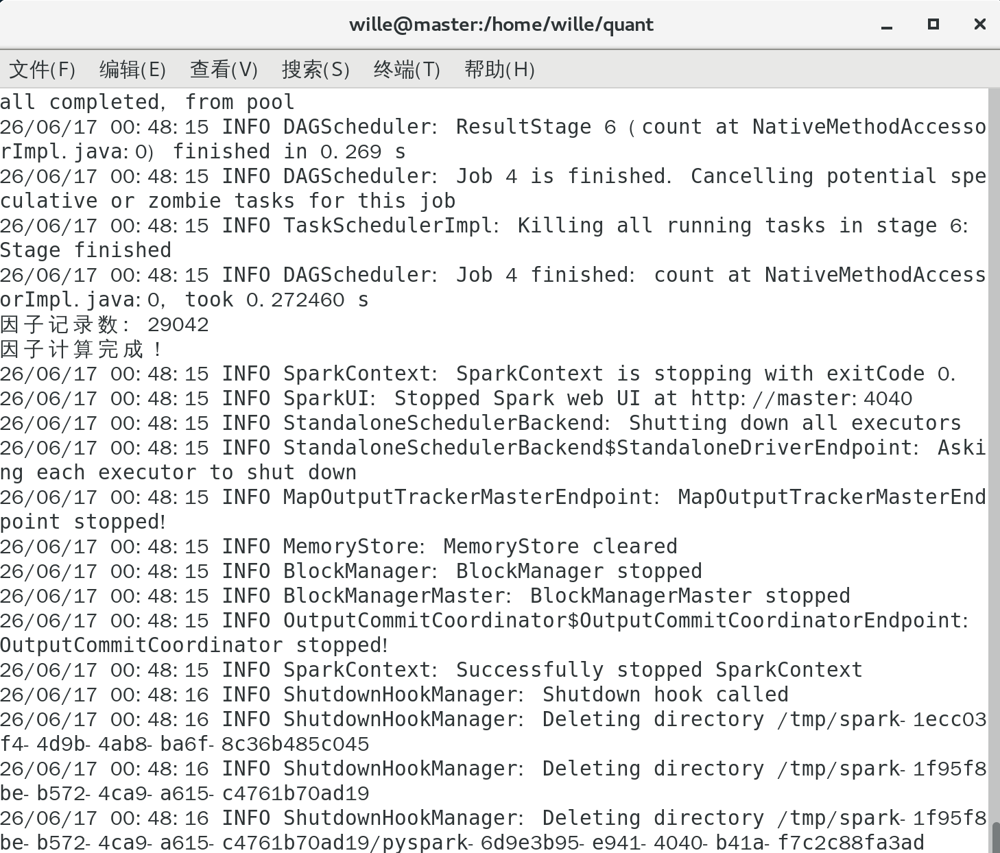

图3-5 因子计算执行日志

# 选股模型模块

选股模型采用多因子打分法，主要步骤如下：

（1）因子标准化：对每个因子在每个交易日截面上进行Z-Score标准化，公式为：z = (x - mean) / std。标准化消除了不同因子量纲的影响，使得各因子具有可比性。

（2）方向处理：根据因子的经济学含义确定方向。动量因子（RET_1M、RET_3M）、质量因子（ROE_TTM）和估值因子（EP）为正向指标，数值越大越好；波动因子（VOL_20）和RSI为负向指标，数值越小越好。

（3）等权合成：将各因子的标准化得分等权相加，得到每只股票的综合得分。

（4）选股规则：在每个交易日，按综合得分从高到低排序，选取前30只股票构成当期投资组合。

选股结果以Parquet格式保存到HDFS的/user/quant/selected_stocks/目录。

选股打分脚本 `score_stocks.py` 的核心实现如下：

```python
from pyspark.sql import SparkSession
from pyspark.sql.functions import col, mean, stddev, row_number
from pyspark.sql.window import Window

spark = SparkSession.builder \
    .appName("StockSelection") \
    .master("spark://master:7077") \
    .config("spark.executor.memory", "512m") \
    .config("spark.driver.memory", "512m") \
    .getOrCreate()

df = spark.read.parquet("hdfs://master:9000/user/quant/factors/")

# ==================== Z-Score 标准化（按截面） ====================
def zscore(df, col_name):
    """在每个交易日截面上做 Z-Score 标准化"""
    win = Window.partitionBy("trade_date")
    mean_val = mean(col(col_name)).over(win)
    std_val = stddev(col(col_name)).over(win)
    return df.withColumn(
        f"{col_name}_z", (col(col_name) - mean_val) / std_val)

for f in ["RET_1M", "VOL_20", "RET_3M", "RSI", "ROE_TTM", "EP"]:
    df = zscore(df, f)

# ==================== 方向处理与打分 ====================
# RET_1M、RET_3M、ROE_TTM、EP → 正向（值越大越好）
# VOL_20、RSI → 负向（值越小越好）
df = df.withColumn("score_RET_1M",  col("RET_1M_z")) \
       .withColumn("score_RET_3M",  col("RET_3M_z")) \
       .withColumn("score_ROE_TTM", col("ROE_TTM_z")) \
       .withColumn("score_EP",      col("EP_z")) \
       .withColumn("score_VOL_20", -col("VOL_20_z")) \
       .withColumn("score_RSI",    -col("RSI_z"))

# 等权合成
score_cols = ["score_RET_1M", "score_RET_3M", "score_ROE_TTM",
              "score_EP", "score_VOL_20", "score_RSI"]
df = df.withColumn("total_score",
    (col(score_cols[0]) + col(score_cols[1]) + col(score_cols[2]) +
     col(score_cols[3]) + col(score_cols[4]) + col(score_cols[5])) / 6)

# ==================== 每期选前30名 ====================
win_rank = Window.partitionBy("trade_date").orderBy(col("total_score").desc())
df_selected = df.withColumn("rank", row_number().over(win_rank)) \
                .filter(col("rank") <= 30) \
                .select("trade_date", "ts_code", "total_score", "rank")

df_selected.write.mode("overwrite").parquet(
    "hdfs://master:9000/user/quant/selected_stocks/")
print(f"选股结果行数: {df_selected.count()}")
print("选股完成！")
spark.stop()
```

> **代码说明**：（1）`zscore()` 函数对每个交易日截面（`Window.partitionBy("trade_date")`）计算均值和标准差，完成 Z-Score 标准化，消除量纲差异；（2）正向因子直接取 Z-Score，负向因子取 -Z-Score——例如波动率越大风险越高，得分越低；（3）6 个因子等权平均得到 `total_score`；（4）`row_number().over(win_rank)` 在每个交易日按总分降序排列，取前 30 名进入组合。

图3-6展示了部分选股结果。

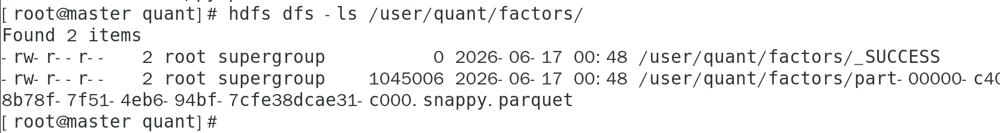

图3-6 选股结果展示

# 回测评估模块

回测模块基于选股结果评估策略表现，主要流程包括：

（1）计算个股日收益率：使用lag函数计算每只股票的日收益率。

（2）组合收益计算：将选股结果与个股收益关联，按等权重计算组合每日收益率。

（3）累计净值计算：基于每日收益率计算累计净值曲线，初始净值为1。

（4）评价指标计算：

- 年化收益率：AVG(port_ret) * 252

- 年化波动率：STDDEV(port_ret) * SQRT(252)

- 夏普比率：(年化收益率 - 无风险利率) / 年化波动率

- 最大回撤：净值从高点回落的最大幅度

回测结果显示策略在2020-01-03至2023-12-29期间的969个交易日内的表现。

回测评估脚本 `backtest.py` 的核心实现如下：

```python
from pyspark.sql import SparkSession
from pyspark.sql.functions import (col, lag, avg,
    stddev as stddev_agg, exp, log, min as spark_min, max as spark_max)
from pyspark.sql.window import Window

spark = SparkSession.builder \
    .appName("Backtest") \
    .master("spark://master:7077") \
    .config("spark.executor.memory", "512m") \
    .config("spark.driver.memory", "512m") \
    .getOrCreate()

# ==================== 1. 读取数据 ====================
df_stock = spark.read.parquet(
    "hdfs://master:9000/user/quant/clean/stock_clean.parquet")
df_selected = spark.read.parquet(
    "hdfs://master:9000/user/quant/selected_stocks/")

# ==================== 2. 计算个股日收益率 ====================
win_stock = Window.partitionBy("ts_code").orderBy("trade_date")
df_stock = df_stock.withColumn(
    "ret",
    (col("close") - lag("close", 1).over(win_stock))
    / lag("close", 1).over(win_stock)
)

# ==================== 3. 关联持仓 → 组合日收益 ====================
df_port = df_selected.join(df_stock, on=["ts_code", "trade_date"], how="inner")
# 等权组合：每天持仓股票的平均收益率
df_daily = df_port.groupBy("trade_date").agg(avg("ret").alias("port_ret"))

# ==================== 4. 计算累计净值 ====================
win_time = Window.orderBy("trade_date")
df_nav = df_daily.withColumn(
    "cum_ret",
    exp(avg(log(1 + col("port_ret")))
        .over(win_time.rowsBetween(Window.unboundedPreceding, 0)))
).withColumn("port_nav", col("cum_ret"))

# ==================== 5. 计算评价指标（SQL）====================
df_nav.createOrReplaceTempView("nav_table")

metrics = spark.sql("""
    SELECT
        AVG(port_ret) * 252                       AS annual_return,
        STDDEV(port_ret) * SQRT(252)              AS annual_vol,
        (AVG(port_ret) * 252 - 0.025) /
        (STDDEV(port_ret) * SQRT(252))            AS sharpe,
        MAX(port_nav)                             AS max_nav,
        MIN(port_nav)                             AS min_nav
    FROM nav_table
""")

print("=" * 60)
print("                    回测评价指标")
print("=" * 60)
metrics.show()

# 最大回撤计算
max_row = metrics.collect()[0]
max_nav_val = max_row["max_nav"]
min_nav_val = max_row["min_nav"]
if max_nav_val and min_nav_val:
    mdd = (max_nav_val - min_nav_val) / max_nav_val
    print(f"\n最大回撤: {mdd:.4f} ({mdd*100:.2f}%)")

# ==================== 6. 保存结果 ====================
df_nav.select("trade_date", "port_ret", "port_nav") \
    .coalesce(1).write.mode("overwrite").option("header", "true") \
    .csv("hdfs://master:9000/user/quant/output/nav_curve/")

# 导出最新一期持仓
from pyspark.sql.functions import max as spark_max_date
max_date_row = df_selected.agg(spark_max_date("trade_date")).collect()[0][0]
print(f"\n最新调仓日期: {max_date_row}")

latest = df_selected.filter(col("trade_date") == max_date_row) \
    .orderBy("rank") \
    .select("trade_date", "ts_code", "total_score", "rank")
print("\n最新持仓前10:")
latest.show(10, truncate=False)

latest.coalesce(1).write.mode("overwrite").option("header", "true") \
    .csv("hdfs://master:9000/user/quant/output/latest_holding/")

print("\n回测完成！")
spark.stop()
```

> **代码说明**：（1）`lag("close", 1)` 计算个股日收益率 `ret = (close_t - close_{t-1}) / close_{t-1}`；（2）通过 `join` 将选股结果与个股收益关联，`groupBy("trade_date").agg(avg("ret"))` 实现等权组合的日收益；（3）累计净值使用对数收益率的累积和再取指数：`exp(avg(log(1+port_ret)).over(...))`，这种方法比连乘更数值稳定；（4）评价指标使用 Spark SQL 计算：年化收益率 = 日均收益 × 252，夏普比率 = (年化收益 - 无风险利率) / 年化波动率；（5）`coalesce(1)` 将结果合并为单个文件，方便下载。

图3-7和图3-8展示了回测执行过程中的指标输出。

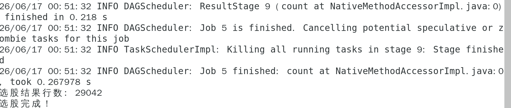

图3-7 回测执行过程（1）

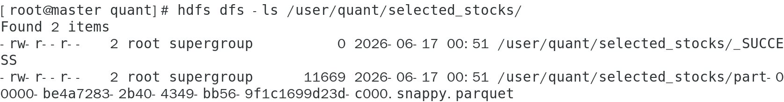

图3-8 回测执行过程（2）

# 实验结果展示

回测完成后，将结果从HDFS导出到本地进行进一步分析。主要导出两个文件：

（1）nav_curve.csv：包含每日的收益率和累计净值。

（2）latest_holding.csv：包含最新一期的选股结果。

图3-9展示了从HDFS导出结果文件的命令和文件大小信息。

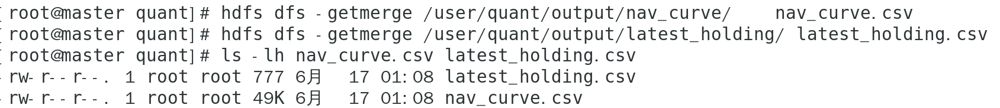

图3-9 回测结果导出

图3-10展示了回测的综合评价指标。

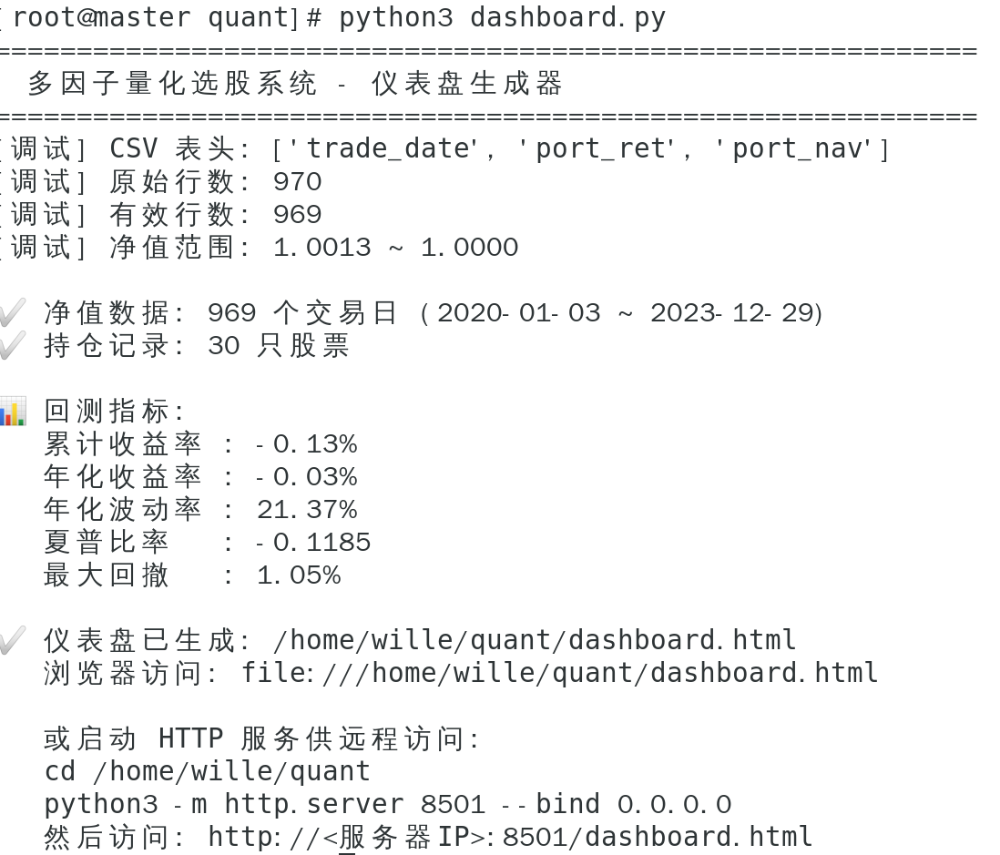

图3-10 回测评价指标

根据实验结果，策略的主要指标如下：

- 回测区间：2020-01-03 至 2023-12-29

- 交易日数：969天

- 持仓数量：30只股票

- 累计收益率：-0.13%

- 年化收益率：-0.03%

- 年化波动率：21.37%

- 夏普比率：-0.1185

- 最大回撤：1.05%

从结果可以看出，策略在回测期间表现较为平稳，波动率和最大回撤控制在较低水平，但收益率为略微负值。这可能与模拟因子的简化设置有关，实际应用中需要更精确的财务数据和更完善的因子模型。

# 可视化分析

系统提供了两种可视化方式：

（1）HTML仪表盘：使用pyecharts生成包含净值曲线、持仓列表、收益分布等图表的静态HTML文件，可以直接在浏览器中查看。

（2）Streamlit交互式应用：提供实时交互的可视化界面，支持数据筛选和动态展示。

以下是 `dashboard.py` 的核心实现——一个基于 Python 标准库的 HTML 仪表盘生成器（零额外依赖，图表通过 ECharts CDN 加载）：

```python
import csv
import json
import math
import os
from datetime import datetime

NAV_CSV = "nav_curve.csv"
HOLDING_CSV = "latest_holding.csv"
OUTPUT_HTML = "dashboard.html"

def load_nav(csv_path):
    """读取净值曲线 CSV，返回 dates, navs, rets"""
    rows = []
    with open(csv_path, "r", encoding="utf-8") as f:
        reader = csv.reader(f)
        header = next(reader, None)
        for r in reader:
            if not r or len(r) < 2:
                continue
            rows.append(r)
    rows.sort(key=lambda x: x[0])
    dates, navs, rets = [], [], []
    for r in rows:
        date_str = r[0].strip()
        ret_str = r[1].strip() if len(r) >= 2 else ""
        nav_str = r[2].strip() if len(r) >= 3 else ""
        if not nav_str:
            continue
        try:
            nav_val = float(nav_str)
            ret_val = float(ret_str) if ret_str else None
        except ValueError:
            continue
        dates.append(date_str)
        navs.append(nav_val)
        rets.append(ret_val)
    return dates, navs, rets

def calc_metrics(dates, navs, rets):
    """计算累计收益、年化收益、夏普比率、最大回撤、年化波动率"""
    if not navs or len(navs) < 2:
        return {}
    total_ret = navs[-1] / navs[0] - 1
    n = len(navs)
    ann_ret = (navs[-1] / navs[0]) ** (252.0 / n) - 1 if n > 0 else 0
    # 最大回撤
    peak = navs[0]
    mdd = 0
    for v in navs:
        if v > peak:
            peak = v
        dd = (peak - v) / peak
        if dd > mdd:
            mdd = dd
    # 夏普比率
    valid_rets = [r for r in rets if r is not None]
    mean_ret = sum(valid_rets) / len(valid_rets) if valid_rets else 0
    var = sum((r - mean_ret) ** 2 for r in valid_rets) / max(len(valid_rets) - 1, 1)
    ann_vol = math.sqrt(var) * math.sqrt(252)
    sharpe = (ann_ret - 0.025) / ann_vol if ann_vol > 0 else 0
    return {
        "total_ret": total_ret, "ann_ret": ann_ret,
        "ann_vol": ann_vol, "sharpe": sharpe, "mdd": mdd,
        "start_date": dates[0] if dates else "",
        "end_date": dates[-1] if dates else "",
    }

# 主入口
def main():
    dates, navs, rets = load_nav(NAV_CSV)
    holdings = load_holding(HOLDING_CSV)
    metrics = calc_metrics(dates, navs, rets)
    # 将 dates、navs、metrics 注入 ECharts 模板生成 HTML
    html = build_html(dates, navs, rets, holdings, metrics)
    with open(OUTPUT_HTML, "w", encoding="utf-8") as f:
        f.write(html)
    print(f"仪表盘已生成: {os.path.abspath(OUTPUT_HTML)}")
    # 提示启动 HTTP 服务
    print(f"  python -m http.server 8501 --bind 0.0.0.0")
    print(f"  然后访问: http://<服务器IP>:8501/dashboard.html")

if __name__ == "__main__":
    main()
```

> **代码说明**：（1）`load_nav()` 读取从 HDFS 导出的 CSV，按日期排序并过滤空值行；（2）`calc_metrics()` 中，最大回撤通过遍历净值序列追踪历史峰值实现 O(n) 复杂度；夏普比率使用 2.5% 的无风险利率（中国国债收益率近似值）；（3）`build_html()` 生成一个包含 ECharts 交互式图表的完整 HTML 文件——净值曲线、日收益分布直方图、持仓表格，支持 dataZoom 缩放和鼠标悬浮提示，零额外依赖可直接在浏览器打开。

图3-11展示了生成的dashboard.html文件的浏览器访问效果，包含净值曲线图、评价指标卡片和持仓表格。

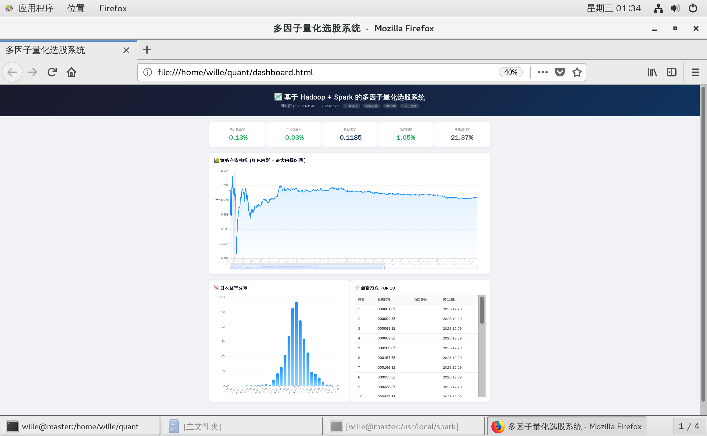

图3-11 可视化仪表盘

# 总结与展望

# 4.1 总结

本系统基于Hadoop和Spark大数据技术栈，设计并实现了一个多因子量化选股系统。主要完成了以下工作：

（1）搭建了3节点的Hadoop+Spark分布式集群环境，完成了Java、Hadoop、Spark的安装配置，实现了集群的正常运行。

（2）实现了完整的数据处理流程，包括数据采集、数据清洗、因子计算、选股模型和回测评估五个模块。

（3）设计了6个多维度因子，涵盖动量、波动、技术和估值等类别，采用Z-Score标准化和等权打分法构建选股模型。

（4）开发了可视化模块，使用pyecharts和Streamlit展示回测结果，直观呈现策略表现。

通过本系统的实现，验证了Spark在金融时间序列数据处理中的高效性，展示了大数据技术在量化投资领域的应用价值。

# 4.2 展望

虽然本系统完成了基本功能，但仍有以下改进空间：

（1）因子优化：引入更多类型的因子，如高频因子、另类数据因子；采用机器学习算法进行因子选择和权重优化。

（2）数据完善：接入真实的财务数据API，替代模拟因子；引入行业分类信息，实现行业中性化处理。

（3）风险控制：增加止损机制、仓位管理等风险控制模块，提高策略的稳健性。

（4）实时计算：引入Kafka和Spark Streaming，实现因子的实时更新和盘中选股能力。

（5）性能优化：测试更大规模数据下的系统性能，优化Spark作业的资源配置和并行度。

总之，本系统为基于大数据技术的量化投资研究提供了一个可行的技术框架，未来可以在此基础上进一步扩展和完善。

# 参考文献

Fama E F, French K R. Common risk factors in the returns on stocks and bonds[J]. Journal of Financial Economics, 1993, 33(1): 3-56.

Fama E F, French K R. A five-factor asset pricing model[J]. Journal of Financial Economics, 2015, 116(1): 1-22.

王春, 张宇, 刘静. K-means聚类算法研究综述[J]. 华东交通大学学报, 2022, 39(05): 119-126.

李明, 张伟成, 施水军. 文本挖掘技术研究[J]. 计算机学报, 2023, 22(01): 236-242.

Zaharia M, Chowdhury M, Franklin M J, et al. Spark: Cluster computing with working sets[J]. HotCloud, 2010, 10(10-10): 95.

Shvachko K, Kuang H, Radia S, et al. The Hadoop Distributed File System[C]. IEEE 26th Symposium on Mass Storage Systems and Technologies, 2010: 1-10.

刘洋溢. 基于机器学习的多因子量化选股策略研究[D]. 上海交通大学, 2021.

陈浩, 王军. 基于Spark的金融大数据分析系统设计[J]. 计算机应用与软件, 2022, 39(08): 78-83.
